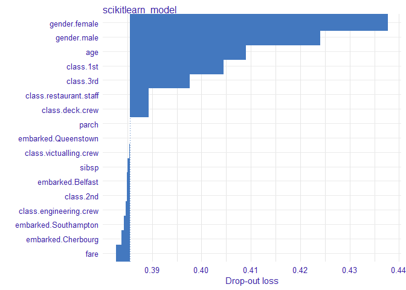
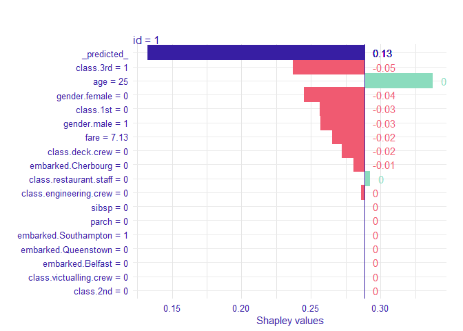

# DALEXtra 

[](https://travis-ci.org/ModelOriented/DALEXtra)
[](https://codecov.io/github/ModelOriented/DALEXtra?branch=master)
[](https://cran.r-project.org/package=DALEXtra)
[](http://drwhy.ai/#BackBone)

## Overview

The `DALEXtra` package is an extension pack for
[DALEX](https://modeloriented.github.io/DALEX) package. This package
provides easy to use connectors for models created with scikitlearn,
keras, H2O, mljar and mlr.

## Installation

    # Install the development version from GitHub:
    
    # it is recommended to install latest version of DALEX from GitHub
    devtools::install_github("ModelOriented/DALEX")
    # install.packages("devtools")
    devtools::install_github("ModelOriented/DALEXtra")

Package `reticulate` will be downloaded along with `DALEXtra` but if you
seek for it’s latests version it can be downloaded here

    devtools::install_github("rstudio/reticulate")

Other packages useful with explanations.

    devtools::install_github("ModelOriented/ingredients")
    devtools::install_github("ModelOriented/iBreakDown")
    devtools::install_github("ModelOriented/shapper")
    devtools::install_github("ModelOriented/auditor")

Above packages can be used along with `explain` object to create
explanations (ingredients, iBreakDown, shapper) or audit our model
(audiotr).

## How to setup Anaconda

In order to be able to use some features associated with `DALEXtra`,
Anaconda in needed. The easiest way to get it, is visting [Anconda
website](https://www.anaconda.com/distribution). And choosing proper OS
as it stands in the following picture.

There is no big difference bewtween Python versions when downloading
Anaconda. You can always create virtual environment with any version of
Pytho no matter which version was downloaded first.

### Windows

Crucial thing is adding conda to PATH environment variable when using
Windows. You can do it during installation, by marking this
checkbox.


or, if conda is already installed, by following [those
instructions](https://stackoverflow.com/a/44597801/9717584).

### Unix

While using unixlike OS, adding conda to PATH is not required.

## Demo

Here we will present short use case for our package and its
compatibility with Python

### Loading data

First we need provide the data, explainer is useless without them. Thing
is Python object does not store training data so always have to provide
dataset. Feel free to use those attached to `DALEX` package or those
stored in `DALEXtra`
files.

``` r
titanic_test <- read.csv(system.file("extdata", "titanic_test.csv", package = "DALEXtra"))
```

Keep in mind that dataframe includes target variable (18th column) and
scikit-learn models cannot work with it.

### Creating explainer

Creating exlainer from scikit-learn Python model is very simple thanks
to `DALEXtra`. The only thing you need to provide is path to pickle and,
if necessery, something that lets recognize Python environment. It may
be .yml file with packages specification, name of existing conda
environment or path to Python virtual environment. Execution of
`scikitlearn_explain` only with .pkl file and data will cause usage of
default Python.

``` r
library(DALEXtra)
explainer <- explain_scikitlearn(system.file("extdata", "scikitlearn.pkl", package = "DALEXtra"),
yml = system.file("extdata", "testing_environment.yml", package = "DALEXtra"), 
data = titanic_test[,1:17], y = titanic_test$survived)
```

    ## Preparation of a new explainer is initiated
    ##   -> model label       :  scikitlearn_model  ([33mdefault[39m)
    ##   -> data              :  524  rows  17  cols 
    ##   -> target variable   :  524  values 
    ##   -> predict function  :  yhat.scikitlearn_model  will be used ([33mdefault[39m)
    ##   -> predicted values  :  numerical, min =  0.02086126 , mean =  0.288584 , max =  0.9119996  
    ##   -> residual function :  difference between y and yhat ([33mdefault[39m)
    ##   -> residuals         :  numerical, min =  -0.8669431 , mean =  0.02248468 , max =  0.9791387  
    ## [32mA new explainer has been created
universe tools to make explanations. Here is a small demo.

``` r
library(DALEX)
plot(model_performance(explainer))
```

<!-- -->

``` r
library(ingredients)
plot(feature_importance(explainer))
```

<!-- -->

``` r
describe(feature_importance(explainer))
```

    ## The number of important variables for scikitlearn_model's prediction is 3 out of 17. 
    ##  Variables gender.female, gender.male, age have the highest importantance.

``` r
library(iBreakDown)
plot(break_down(explainer, titanic_test[2,1:17]))
```

<!-- -->

``` r
describe(break_down(explainer, titanic_test[2,1:17]))
```

    ## Scikitlearn_model predicts, that the prediction for the selected instance is 0.132 which is lower than the average model prediction.
    ##  
    ## The most important variables that decrease the prediction are class.3rd, gender.female. 
    ## The most important variable that increase the prediction is age.
    ##  
    ## Other variables are with less importance. The contribution of all other variables is -0.108 .

``` r
library(shapper)
plot(shap(explainer, titanic_test[2,1:17]))
```

<!-- -->

``` r
library(auditor)
eval <- model_evaluation(explainer)
plot_roc(eval)
```

<!-- -->

``` r
# Predictions with newdata
predict(explainer, titanic_test[1:10, 1:17])
```

    ##  [1] 0.3565896 0.1321947 0.7638813 0.1037486 0.1265221 0.2949228 0.1421281
    ##  [8] 0.1421281 0.4154695 0.1321947

## Acknowledgments

Work on this package was financially supported by the ‘NCN Opus grant
2016/21/B/ST6/02176’.
