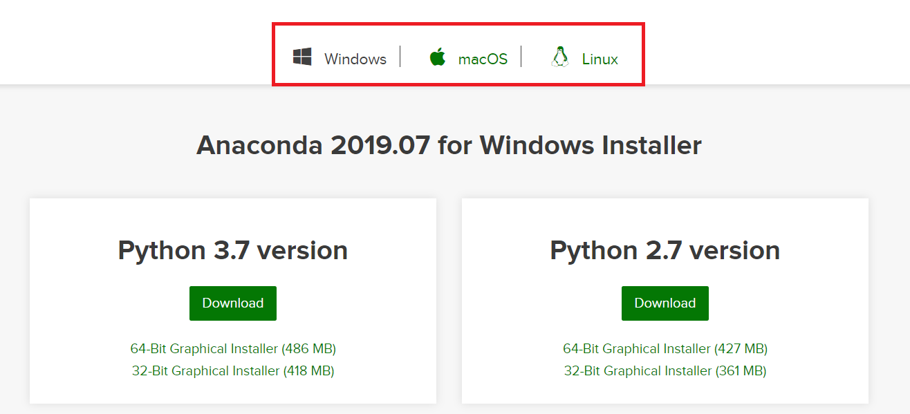
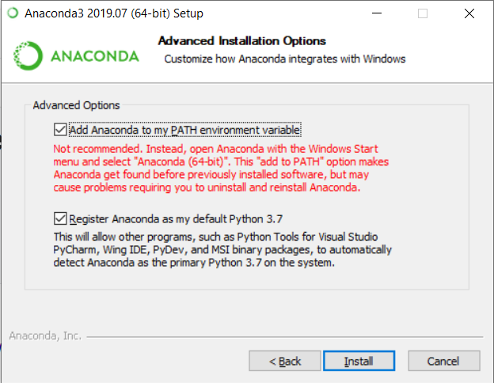
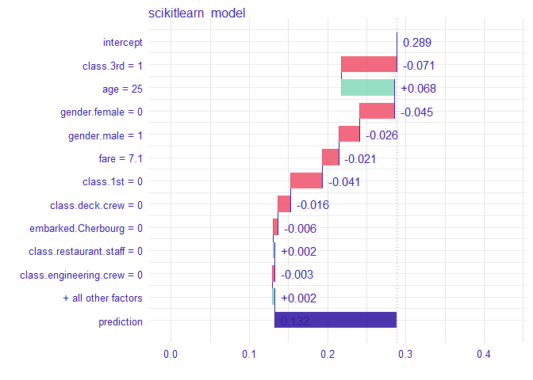

# DALEXtra

[](https://travis-ci.org/ModelOriented/DALEXtra)
[](https://codecov.io/github/ModelOriented/DALEXtra?branch=master)

An extension for DALEX package

# Anaconda

In order to be able to use some features associated with `DALEXtra`,
Anaconda in needed. The easiest way to get it, is visting [Anconda
website](https://www.anaconda.com/distribution). And choosing proper OS
as it stands in the following picture.
 There is no big difference
bewtween Python versions when downloading conda therefore it is
recommended to choose Python 3.7 (newer Anaconda version) and then
downloading python 2.7.

## Windows

Crucial thing is adding conda to PATH environment variable when using
Windows. You can do it during installation, by marking this checkbox.



or, if conda is already installed, by following [those
instructions](https://stackoverflow.com/a/44597801/9717584).

## Unix

While using unixlike OS, adding conda to PATH is not required.

# Installation and configuration

Package can be installed with execution of the following code

    install.packages("devtools")
    devtools::install_github("ModelOriented/DALEXtra")
    devtools::install_github("pbiecek/DALEX")

It is recommended to install latests github version of DALEX

Package `reticulate` will be downloaded along with `DALEXtra` but if you
seek for its latests version it can be downloaded here

    devtools::install_github("rstudio/reticulate")

Packages useful with explanations

    devtools::install_github("ModelOriented/ingredients)
    devtools::install_github("ModelOriented/iBreakDown)
    devtools::install_github("ModelOriented/shapper)
    devtools::install_github("MI2DataLab/auditor")

<https://modeloriented.github.io/DALEXtra/>

# Demo

Here we will present short use case for our package and its
compatibility with Python

## Loading data

First we need data, explainer is useless without them. Thing is Python
object does not store training data so always have to proviede dataset.
Feel free to use those attached to `DALEX` package or those stored in
`DALEXtra`
files.

``` r
titanic_test <- read.csv(system.file("extdata", "titanic_test.csv", package = "DALEXtra"))
```

Keep in mind that that dataframe includes targer variable (18th column)
and scikit-learn models do not like it

## Creating explainer

``` r
library(DALEXtra)
explainer <- explain_scikitlearn(system.file("extdata", "scikitlearn.pkl", package = "DALEXtra"),
yml = system.file("extdata", "scikitlearn_unix.yml", package = "DALEXtra"), 
data = titanic_test[,1:17], y = titanic_test$survived)
```

    ## Preparation of a new explainer is initiated
    ##   -> model label       :  scikitlearn_model  (default)
    ##   -> data              :  524  rows  17  cols 
    ##   -> target variable   :  524  values 
    ##   -> predict function  :  yhat.scikitlearn_model  will be used (default)
    ##   -> predicted values  :  numerical, min =  0.02086126 , mean =  0.288584 , max =  0.9119996  
    ##   -> residual function :  difference between y and yhat (default)
    ##   -> residuals         :  numerical, min =  -0.8669431 , mean =  0.02248468 , max =  0.9791387  
    ## A new explainer has been created!

Creating exlainer from scikit-learn Python model is very simple thanks
to `DALEXtra`. The only thing you need to provide is path to pickle and,
if necessery, something that lets recognize Python environment. It may
be .yml file with packages specification, name of existing conda
environment or path to Python virtual environment. Execution of
`scikitlearn_explain` only with .pkl file and data will cause usage of
default Python.

## Creating explanations

Now with explainer ready we can use any of DrWhy.ai universe tools to
make explanations. Here is small demo

``` r
library(DALEX)
plot(model_performance(explainer))
```

<!-- -->

``` r
library(ingredients)
plot(feature_importance(explainer))
```

<!-- -->

``` r
library(iBreakDown)
plot(break_down(explainer, titanic_test[2,1:17]))
```

<!-- -->

``` r
library(shapper)
plot(shap(explainer, titanic_test[2,1:17]))
```

<!-- -->

``` r
library(auditor)
plotROC(audit(explainer))
```

    ## Warning in rev(as.numeric(df$label)): NAs introduced by coercion

<!-- -->

``` r
# Predictions with newdata
predict(explainer, titanic_test[1:10, 1:17])
```

    ##  [1] 0.3565896 0.1321947 0.7638813 0.1037486 0.1265221 0.2949228 0.1421281
    ##  [8] 0.1421281 0.4154695 0.1321947
